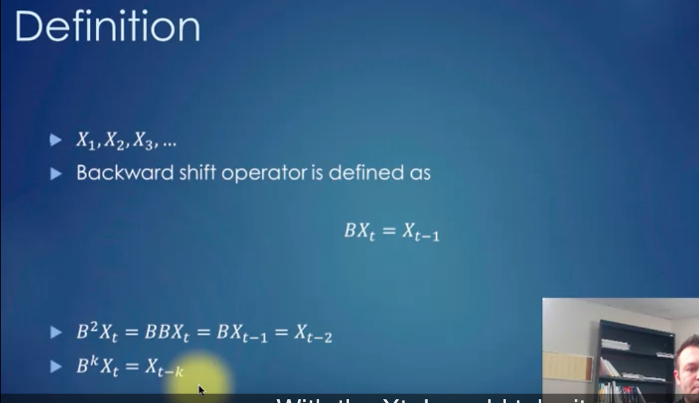

# Backward Shift Operator applied to MA and AR process

## Backward Shift Operator

<br /> 
<br /> 
**Definition**
<br /> 
For a time series $Yt$, the backward shift operator $B$ is defined as:
<br /> 
<br /> 
$B(Yt) = Yt-1$
<br /> 
<br /> 
This means that applying $B$ to $Yt$ gives you the previous value in the series.

**Multiple applications** <br /> 
You can apply B multiple times: <br /> 
$B²(Yt) = B(B(Yt)) = B(Yt-1) = Yt-2$ <br /> 
$B^kXt = X{t-k}$

```
import numpy as np
import pandas as pd
import matplotlib.pyplot as plt

# Create a simple time series
np.random.seed(0)
t = np.arange(100)
y = 10 + 0.5*t + np.random.normal(0, 2, 100)

# Create a DataFrame
df = pd.DataFrame({'t': t, 'y': y})

# Apply backward shift operator
df['y_lag1'] = df['y'].shift(1)  # B(Yt)
df['y_lag2'] = df['y'].shift(2)  # B²(Yt)

# Plot the results
plt.figure(figsize=(12,6))
plt.plot(df['t'], df['y'], label='Original')
plt.plot(df['t'], df['y_lag1'], label='B(Yt)')
plt.plot(df['t'], df['y_lag2'], label='B²(Yt)')
plt.legend()
plt.title('Time Series with Backward Shift Operator')
plt.xlabel('Time')
plt.ylabel('Value')
plt.show()

# Print first few rows
print(df.head())
```

